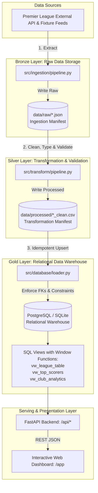

# ⚽ EPL Club Data Platform &bull; Data Engineering Pipeline

[](https://www.python.org/)
[](https://fastapi.tiangolo.com/)
[](https://www.sqlalchemy.org/)
[]()

An end-to-end **Data Engineering Platform** built for exploring the English Premier League (EPL). Rather than simply being a static football website, this project demonstrates a genuine, production-grade **ELT/ETL Data Pipeline** from bronze ingestion to silver transformations, gold relational data warehousing, analytical SQL window views, REST APIs, and an interactive presentation dashboard.
WTC-LHVJQSJP
---

## 🏛️ Pipeline Architecture



---

## 🎯 Elective Presentation Highlights

This platform directly satisfies the core requirements of an advanced Data Engineering elective:

### 1. Data Ingestion & Bronze Tier (Raw Storage)
- **Immutable Raw Lake**: Preserves raw JSON payloads in `data/raw/` with ingestion timestamps (`_ingested_at`) and source metadata before any transformations occur.
- **Lineage Tracking**: Generates `ingestion_manifest.json` recording batch timestamps, file locations, and record counts.

### 2. Data Cleaning, Transformation & Validation (Silver Tier)
- **Data Cleansing**: Strips irregular whitespace, coerces casing, and handles missing values.
- **Categorical Normalization**: Maps messy position inputs (`"midfielder"`, `"FORWARD"`, `"fwd"`) into canonical standards (`Goalkeeper`, `Defender`, `Midfielder`, `Forward`).
- **Regex Parsing**: Splits compound score strings (`"2 - 0"`, `"1:1"`) into discrete `home_score` and `away_score` integer metrics.
- **Mathematical Invariant Validation**: Enforces domain integrity rules (e.g., `played == won + drawn + lost`, `points == (won * 3) + drawn`). Throws explicit `ValueError` if dirty data violates invariants.
- **Window Computations**: Derives rolling recent form (`"W-W-D-W-L"`) by querying historical fixture sequences.

### 3. Relational Modeling & Constraints (Gold Tier)
- **Normalized Schema (3NF)**:
  - `clubs`: Club ID (PK), name (Unique), stadium, capacity (`CHECK capacity > 0`), founded year (`CHECK founded_year >= 1800`), colors.
  - `players`: Player ID (PK), club ID (FK &rarr; `clubs.club_id` with `CASCADE`), position index, appearances, goals, assists.
  - `matches`: Match ID (PK), home/away club IDs (Dual FKs &rarr; `clubs.club_id`), `CHECK (home_club_id != away_club_id)`.
  - `standings`: Club ID (Unique FK &rarr; `clubs.club_id`), points, goal difference, win rate.
- **Indexing**: B-Tree indexes placed on high-cardinality join keys (`club_id`), filter columns (`position`, `gameweek`), and sorting fields (`points`, `goals`).

### 4. Advanced SQL & Analytical Views
- **Window Ranking**: Dynamic standings calculated via `DENSE_RANK() OVER (ORDER BY s.points DESC, s.goal_difference DESC, s.goals_for DESC)`.
- **Top Scorers Leaderboard**: Player ranks computed via `ROW_NUMBER() OVER (ORDER BY p.goals DESC, p.assists DESC)`.
- **Aggregations & Multi-Table Joins**: Club squad size, total goals, and stadium statistics aggregated via `COUNT(DISTINCT ...)`, `SUM()`, and `AVG()`.

### 5. Idempotent Database Loading
- The loader uses an **upsert / merge strategy**. Running the pipeline 1 time or 100 times produces identical, error-free database states without duplicate key violations.
- Transactions are managed via atomic session context managers (`session.commit()` on success, `session.rollback()` on failure).

---

## 📂 Project Structure

```
epl-data-platform/
├── data/
│   ├── raw/                 # Bronze: Raw JSON extracts & ingestion manifest
│   └── processed/           # Silver: Cleaned CSVs/JSONs & transform manifest
├── src/
│   ├── config.py            # Global paths, environment settings, DB URL
│   ├── pipeline_runner.py   # Master ELT orchestrator script
│   ├── ingestion/           # Ingestion extractors (Clubs, Players, Matches, Standings)
│   ├── transform/           # Data cleaning, schema validation, form calculations
│   ├── database/            # SQLAlchemy models, connection pool, views, and loader
│   └── api/                 # FastAPI REST API serving endpoints
├── frontend/                # Interactive UI with live pipeline trigger & stats
├── tests/                   # Automated unit & integration tests (pytest)
├── docker-compose.yml       # Optional containerized PostgreSQL warehouse
├── requirements.txt         # Production dependencies
└── README.md
```

---

## 🚀 Quickstart Guide

### 1. Clone & Install Dependencies

```bash
git clone https://github.com/MonchoKK/epl-data-platform.git
cd epl-data-platform
pip install -r requirements.txt
```

### 2. Run the Full End-to-End Pipeline

Execute the master orchestrator to extract, clean, and load the warehouse:

```bash
python -m src.pipeline_runner
```

Output summary:
```text
=================================================================
  🚀 STARTING EPL CLUB DATA PLATFORM - END-TO-END DATA PIPELINE  
=================================================================
--- [STAGE 1/3] INGESTION (BRONZE LAYER) ---
Saved 10 raw clubs records to data/raw/clubs_raw.json
Saved 20 raw players records to data/raw/players_raw.json
Saved 15 raw matches records to data/raw/matches_raw.json
Saved 10 raw standings records to data/raw/standings_raw.json

--- [STAGE 2/3] TRANSFORMATION (SILVER LAYER) ---
Cleaned 10 club records successfully.
Cleaned 20 player records successfully.
Cleaned 15 match records successfully.
Cleaned and ranked 10 standings records successfully.

--- [STAGE 3/3] WAREHOUSE LOADING (GOLD LAYER) ---
All tables created successfully.
Deploying analytical SQL views to data warehouse...
Warehouse loading complete! (Clubs: 10, Players: 20, Matches: 15, Standings: 10)
=================================================================
  ✅ EPL DATA PIPELINE COMPLETED SUCCESSFULLY IN 0.62 SECONDS  
=================================================================
```

### 3. Run Automated Tests

```bash
pytest
```

*(Runs 10 unit and integration tests covering extraction, mathematical invariants, schema cleaning, and SQL view ranking).*

### 4. Launch the API & Web Dashboard

Start the FastAPI application:

```bash
uvicorn src.api.main:app --reload --port 8000
```

- **Interactive Web Dashboard**: [http://127.0.0.1:8000/app/index.html](http://127.0.0.1:8000/app/index.html)
- **FastAPI Interactive Docs**: [http://127.0.0.1:8000/docs](http://127.0.0.1:8000/docs)

---

## 🔌 API Endpoints Reference

| Method | Endpoint | Description |
|---|---|---|
| `GET` | `/api/health` | Warehouse connection and platform health status |
| `GET` | `/api/standings` | Official league table from SQL window view `vw_league_table` |
| `GET` | `/api/clubs` | List clubs (filterable by `city`) |
| `GET` | `/api/clubs/{id}` | Club profile with squad roster and recent matches |
| `GET` | `/api/players` | List players (filterable by `position`, `club_id`, `search`) |
| `GET` | `/api/matches` | Fixtures and results (filterable by `gameweek`, `club_id`) |
| `GET` | `/api/analytics/top-scorers` | Golden boot leaders from SQL view `vw_top_scorers` |
| `GET` | `/api/analytics/club-summary` | Aggregated squad metrics from SQL view `vw_club_analytics` |
| `POST` | `/api/pipeline/trigger` | Triggers on-demand execution of the full ELT pipeline |

---

## 🎙️ Elective Presentation Talking Points

When presenting this project to your instructor:

1. *"I structured the repository following the standard **Medallion Data Architecture**: Bronze (raw lake), Silver (cleaned and validated), and Gold (relational data warehouse)."*
2. *"Rather than accepting dirty data blindly, my transformation layer validates mathematical invariants such as `points == (won * 3) + drawn`, parses compound strings using regex, and normalizes categorical positions."*
3. *"The database is modeled in Third Normal Form (3NF) with primary and foreign keys, cascading deletes, check constraints, and B-Tree indexes on join paths."*
4. *"Instead of computing rankings in application code, I implemented analytical SQL views that leverage window functions like `DENSE_RANK()` and `ROW_NUMBER()` directly in the database engine."*
5. *"The entire pipeline is idempotent: running it repeatedly causes zero duplicate errors and safely merges changes into the warehouse."*
